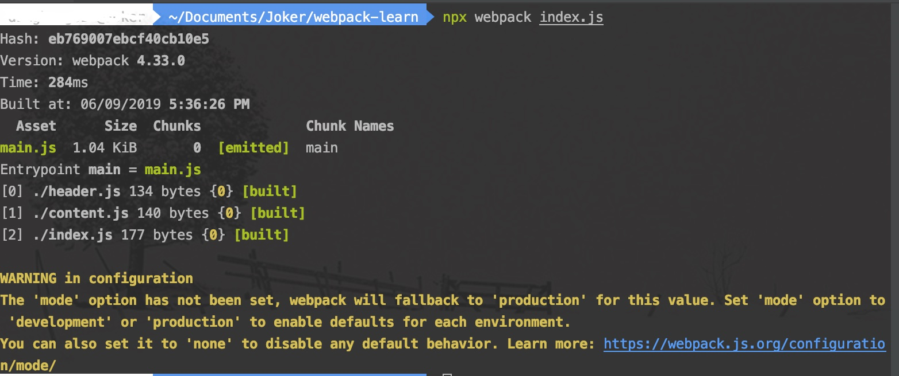
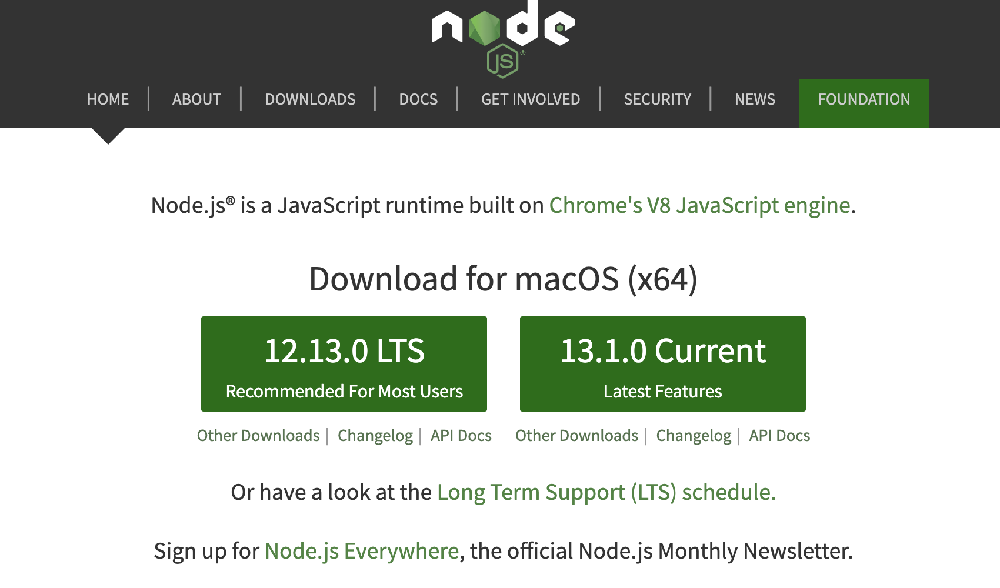
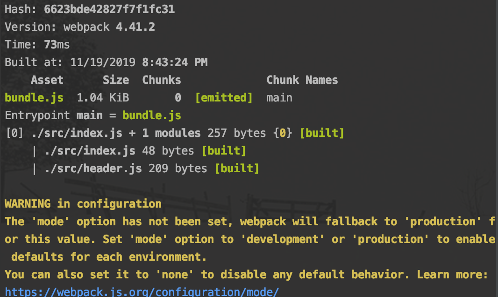

## webpack 初识

1. [webpack 是什么](#what-webpack)
2. [搭建 webpack 环境](#webpack-environment)
3. [使用 webpack 配置文件](#use-config)
4. [浅析 webpack 打包输出内容](#build-content)

###  <a name="what-webpack">webpack 是什么</a>

原始的网页开发：

```html
<!DOCTYPE html>
<html lang="en">
<head>
    <meta charset="UTF-8">
    <title>原始网页开发</title>
</head>
<body>
  <div id="root"></div>
  <script src="./index.js"></script>
</body>
</html>
```

```javascript
// index.js

var root = document.getElementById('root');

var header = document.createElement('div');
header.innerText='header';
root.append(header);

var content = document.createElement('div');
content.innerText='content';
root.append(content);
```

如上采用`面向过程`的方式来写代码，所有的 Js 逻辑都堆在一个文件里，这个文件会堆得越来越长，最终变得难以维护。

后我们采用`面向对象`的方式来写代码：

```html
<!DOCTYPE html>
<html lang="en">
<head>
    <meta charset="UTF-8">
    <title>原始网页开发</title>
</head>
<body>
  <div id="root"></div>
  <script src="./header.js"></script>
  <script src="./content.js"></script>
  <script src="./index.js"></script>
</body>
</html>
```

```javascript
// header.js
function Header() {
  var header = document.createElement('div');
  header.innerText='header';
  root.append(header);
}

// content.js
function Content() {
  var content = document.createElement('div');
  content.innerText='content';
  root.append(content);
}

// index.js
var root = document.getElementById('root');

new Header();
new Content();

```

使用如上面向对象的方式确实在一定程度上提高了代码的可维护性，但同时也存在如下问题：

* http 请求增加；
* 从代码中看不出 js 文件之间的依赖关系；

* 对引入 js 文件的顺序有要求；

我们再来改造一下：

```html
<!DOCTYPE html>
<html lang="en">
<head>
    <meta charset="UTF-8">
    <title>webpack-learn</title>
</head>
<body>
  <div id="root"></div>
  <script src="./index.js"></script>
</body>
```

```javascript
// index.js
//ES Moudle 模块引入方式
import Header from './header.js';
import Content from './content.js';

new Header();
new Content();

// header.js
function Header() {
  var root = document.getElementById('root');
  var header = document.createElement('div');
  header.innerText='header';
  root.append(header);
}

// content.js
function Content() {
  var root = document.getElementById('root');
  var content = document.createElement('div');
  content.innerText='content';
  root.append(content);
}

```

但这样直接运行的话，会报错`Uncaught SyntaxError: Unexpected identifier`，因为浏览器压根就不认识`ES Module 模块引入方式`。这个时候 `webpack` 就派上用场了，虽然浏览器不认识，但经`webpack`"翻译”之后就能识别了。

在上面代码基础之上，在当前目录下运行`npm init`并安装`webpack`和`webpack-cli`；运行`npx webpack index.js`(用`webpack`去翻译`index.js`文件)；



这个时候会发现在目录下多了个`dist`文件夹，`dist`文件夹下多了一个`main.js`文件；

```
.
├── dist
│   └── main.js
├── node_modules
├── index.html
├── index.js
├── header.js
├── content.js
├── package.json
```

现在我们在`index.html`引入经`webpack`"翻译"过后的文件:

```html
<!DOCTYPE html>
<html lang="en">
<head>
    <meta charset="UTF-8">
    <title>webpack-learn</title>
</head>
<body>
  <div id="root"></div>
  <script src="./dist/main.js"></script>
</body>
</html>
```

现在浏览器里打开`index.html`还是会报错（因为使用了`ES Module`模块引入方式，但`header.js`今儿`content.js`并没有采用`ES Module`模块导出方式），再修改下代码：

```javascript
// index.js
//ES Moudle 模块引入方式
import Header from './header.js';
import Content from './content.js';

new Header();
new Content();

// header.js
function Header() {
  var root = document.getElementById('root');
  var header = document.createElement('div');
  header.innerText='header';
  root.append(header);
}

export default Header


// content.js
function Content() {
  var root = document.getElementById('root');
  var content = document.createElement('div');
  content.innerText='content';
  root.append(content);
}

export default Content
```

再运行`npx webpack index.js`重新"翻译"` index.js`，就能正常打开了。那 **webpack 就是一个 Js 代码的翻译器？**

其实官网对 webpack 的定义是：**webpack  is a module bundler**

[模块、webpack模块？](https://webpack.js.org/concepts/modules/#what-is-a-webpack-module)

```javascript
import Header from './header.js';
import Content from './content.js';
```

可以将 import 后面的 `Header`或者`Content`视为一个个`模块，`当然除了这种`ES6 模块引入方法`还有诸如`Common JS`、`CMD`及`AMD`等模块引入规范。webpack 打包的模块也不仅限于`JS 文件`了，比如`Css 文件`、`jpg 等图片文件`等等都可以用 webpack 进行打包。

### <a name="webpack-environment">搭建 webpack 环境</a>

webpack 是基于 `Node.js`开发的模块打包工具，自然得先安装`Node.js`，这儿推荐用 [nvm 安装]([https://github.com/DlLucky/Note/tree/master/Node%E7%89%88%E6%9C%AC%E7%AE%A1%E7%90%86%E5%B7%A5%E5%85%B7%E5%AE%89%E8%A3%85](https://github.com/DlLucky/Note/tree/master/Node版本管理工具安装))。

> 什么是 [nvm](https://github.com/nvm-sh/nvm) ？nvm(Node.js Version Manager) 是 Node.js 的包管理器，可以通过它方便安装和切换不同的Node.js 版本

1. 安装webpack，`nvm install v12.13.0`

   

2. 创建空目录和 `package.json`

   ```json
   mkdir my-project
   cd my-project
   npm init -y // 初始化项目以符合 node 规范, -y 默认选择 yse
   ```

   

3. 安装 webpack 和 webpack-cli

   > 什么是[webpack-cli](https://webpack.js.org/api/#cli)？自webpack 4以后独立的 webpack 命令行工具包

   * 在全局安装，并不推荐，因为不同项目可能使用的 webpack 版本或者配置不一样而至打包可能出错

     ```json
     npm install webpack webpack-cli -g
     webpack -v // 检查 webapck 是否安装成功
     ```

     

   * 在项目内安装

     ```json
     npm install webpack webpack-cli -D
     npx webpack -v // 检查 webapck 是否安装成功
     // 或者 ./node_modules/.bin/webpack -v
     ```

### <a name="use-config">使用 webpack 配置文件</a>

前面的例子，虽然没有看到 webpack 的配置文件，但用`npx webpack index.js`照样能打包？其实是运行`npx webpack`的时候，webpack 会去找默认的配置文件 `webpack.config.js` ，其默认配置文件默认是打包的 `src` 下面的 `index.js` 到 `dist`目录下，但前面的例子`index.js`并没有在 `src`下，如果在在`src`下，直接运行`npx webpack`或者`./node_modules/.bin/webpack`便可用 webpack 的默认配置文件进行打包。

但开发中，我们可能要指定不同的配置文件应用于不同的环境，那 webpack 如何使用指定的配置文件进行打包？
用`npx webpack --config 指定的配置文件` ，比如`npx webpack --config webpack.dev.js`

而且在实际开发中，可能很少看到用 `npx webpack` 或者 `./node_modules/.bin/webpack`去打包我们的项目，而更常见是用 `npm run`这样的方式去打包。

用`npm scripts`方式打包的一个简单示例：

```json
.
├── dist
│   └── bundle.js
├── node_modules
├── index.html
├── package-lock.json // 锁定 npm 包版本，暂且不管
├── package.json
├── src
│   ├── header.js
│   └── index.js
└── webpack.config.js

```

```javascript
// webpack.config.js
const path = require('path');

module.exports = {
    entry: './src/index.js',
    output: {
        path: path.resolve(__dirname, 'dist'),
        filename: "bundle.js"
    }
};
```

```jso
// package.json

{
  "name": "webpack-demo",
  "version": "1.0.0",
  "description": "",
  "main": "index.js",
  "scripts": {
    "build": "webpack"
  },
  "author": "",
  "license": "ISC",
  "devDependencies": {
    "webpack": "^4.41.2",
    "webpack-cli": "^3.3.10"
  }
}

```

运行`npm run build`构建的时候，其实就是运行的`package.json`里面`scripts`下面的`build`命令，从而运行webpack，而在 scripts下面能直接运行 webpack，是因为模块局部安装的时候会在`node_modules/.bin`目录下创建一个软链接

### <a name="build-content">浅析 webpack 打包输出内容</a>

对上面例子，运行`npm run build`进行打包，其输出信息如下图



`Hash`：代表本次打包唯一一个 hash 值；

`Version`：打包所使用的 webpack 版本是 4.41.2 ；

`Time`：打包耗时 73 ms；

`Asset`：打包输出的文件，在这儿是`bundle.js`，在复杂的打包输出中，可能并不止一个文件；

`Size`：打包输出的文件对应大小，在这儿即`bundle.js`大小为 1.04 kb；

`Chunks`：打包输出的文件对应的 id，在这儿即`bundle.js`对应的 id 是 0；

`Chunk Names`：打包输出的文件对应的名称，子这让即`bundle.js`对应的名称是`main`；

> 这儿的`main`，其实来自于 webpack 配置文件中的 entry
>
> ```javascript
> // 在 webpack 配置文件 webpack.config.js 中 
> entry: "./src/index.js",
> // 等价于
> entry: {
>   main: "./src/index.js"
> }
> ```

`Entrypoint main`：整个打包过程中的入口文件；

再往下是依次打包的文件；

最后有一个警告，它意思`mode`没有被设置，webpack 将默认设置`mode`值为 'development' 。根据提示，去设置上`mode`，自然也就没有这个警告了。


