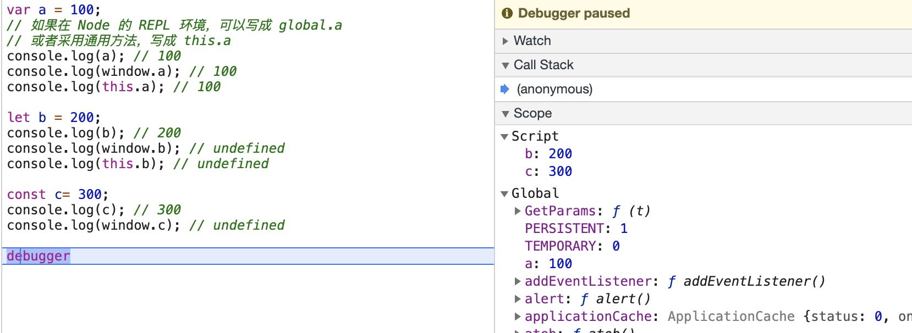

## Js作用域及闭包
#### &sect; [执行环境及作用域](#js-scope)
* [为什么需要块级作用域？](#why-blockScope)
* [ES6块级作用域(let/const)](#es6-blockScope)
#### &sect; [闭包](#js-closures)

#### &sect;<a name="js-scope">执行环境及作用域</a>

　　执行环境(或者叫作用域)定义了变量或者函数有权访问的其他数据，决定了它们各自的行为。**每个执行环境都有一个与之关联的变量对象，执行环境中定义的所有变量和函数都保存在这个对象中**。虽然我们编写代码的时候无法访问这个变量对象，但解析器在处理数据时会在后台使用它。

　　**全局执行环境**是最外围的一个执行环境。根据ECMAScript实现所在的宿主环境不同，表示执行环境的对象也不一样。在Web浏览器中，全局执行环境被认为是window对象，因此所有全局变量和函数都是作为window对象的属性和方法创建的。**某个执行环境中的所有代码执行完毕后，该环境被销毁，保存在其中的所有变量和函数定义也随之销毁**(全局执行环境直到应用程序退出----例如关闭网页或浏览器时才会被销毁)。

　　每个函数都有自己的执行环境，即**函数执行环境**。当执行流进去一个函数时，函数的环境会被推入一个环境栈中，而在函数执行之后，栈将其环境弹出，把控制权交返给之前的执行环境。

　　**当代码在一个环境中执行时**(当执行流进入一个执行环境时)，会创建变量对象的一个**作用域链**。作用域链的用途是保证对执行环境有权访问的所有变量和函数的有序访问。**作用域链的前端**，始终都是当前执行的代码所在环境的变量对象。如果这个环境是函数，则将其**活动对象**作为变量对象。活动对象在最开始的时候只包含一个变量，即arguments对象(这个对象在全局环境中是不存在的)。作用域链的下一个变量对象来自包含(外部)环境，而再下一个变量对象则来自下一个包含环境。这样，一直延续到全局执行环境；**全局执行环境的变量对象始终都是作用域链的最后一个对象(也即作用域链的末端)**

　　**标识符的解析是沿着作用域链一级一级向上搜索的过程**。搜索过程始终从作用域链的前端开始，然后逐级地向后回调，直至找到标识符为止(如果找不到标志符，通常会导致错误发生)。

　　在ES6之前，JavaScript中的作用域只有**全局作用域**和**函数作用域**，并没有如其他类C语言由花括号封闭的块都是自己的作用域，**JavaScript没有块级作用域**，但在JavaScript中，if语句、for语句中的变量声明会将声明的变量添加到当前执行环境中(添加到当前执行环境所关联的变量对象上)。

```javascript
// ---------------全局作用域---------------
// 通过var声明一个全局变量的时候，实际上是定义了全局对象window的一个属性
var counter = 100;

console.log(counter); // 100
console.log(window.counter); // 100
```

```javascript
// ---------------函数作用域---------------

function func() {
  // 通过var声明的变量,会有变量提升,var会提升到当前函数作用域的顶部并且默认赋值为undefined
  console.log(counter); // undefined
  var counter = 100;
  console.log(counter); // 100
}
func();
console.log(counter); // Uncaught ReferenceError: counter is not defined
```


```javascript
// ---------------if语句/for语句(通过var声明)---------------
// 在ES6之前，JS不存在块级作用域，if语句或者for语句中通过var声明的变量是被添加到了当前的执行环境(在这里是全局执行环境)中
if (true) {
  var counter = 100;
}
console.log(counter); // 100
console.log(window.counter); // 100

{
  var num = 1000;
}
console.log(num); // 1000
console.log(window.num); // 1000
```

#####  ⊙ <a name="why-blockScope">为什么需要块级作用域？</a>

　　如上所述，在ES6之前，只有全局作用域和函数作用域，没有块级作用域。而这带来很多不合理的场景。

* 场景一：内层变量可能会覆盖外层变量

  ```javascript
  var counter = 100;
  function func() {
    console.log(counter); // undefined
    if (true) {
      var counter = 1;
    }
  }
  func();
  ```

　　上面代码的原意是，`if`代码块的外部使用外层的`counter`变量，内部使用内层的`counter`变量。但是，函数`func`执行后，输出结果为`undefined`，原因在于`var`声明的变量会有变量提升，导致内层的`counter`变量覆盖了外层的`counter`变量。

* 场景二：用来计数的循环变量泄露为全局变量

```javascript
for (var i = 0; i < 10; i++) {
  // do something
}

console.log(i); // 10
```

　　上面代码中，变量`i`只用来控制循环，但是循环结束后，它并没有消失，泄露成了全局变量。为什么呢？for循环分为3部分，第一部分包含一个变量声明，变量`i`是`var`命令声明的，在全局范围内都有效，所以全局只有一个变量`i`，第二部分包含一个循环的退出条件，第三部分包含每次循环最后要执行的表达式，也就是说第一部分在这个for循环中只会执行一次var i = 0，而后面的两个部分在每次循环的时候都会执行一遍。

　　ES6中，用let,const声明变量，用以替代老语法的var关键字，与var不同的是，**let/const会创建一个块级作用域**（通俗讲就是一个花括号内是一个新的作用域）

##### ⊙ <a name="es6-blockScope">ES6块级作用域(let/const)</a>

　**我们建议对所有的引用使用 `const` ，不要使用 `var`；如果你一定需要可变动的引用，使用 `let` 代替 `var`。**

```javascript
// bad
var a = 100;

var count = 1;
if (true) {
  count += 1;
}
 
// good
const a = 100;

let count = 1;
if (true) {
  count += 1;
}
```

* **用let/const声明变量，会创建一个块级作用域，所声明的变量只在它所在的代码块中有效。**

 ```javascript
{
  var a = 100;
  let b = 200;
  const c = 300;
}
console.log(a); // 100
console.log(b); // Uncaught ReferenceError: a is not defined
console.log(c); // Uncaught ReferenceError: a is not defined
 ```

再用let替换var来看上面提到过用于循环计数的场景：

```javascript
for (let i = 0; i < 10; i++) {
  // do something
}

console.log(i); // Uncaught ReferenceError: i is not defined
```

　　使用let/const关键字声明变量的for循环，除了会创建块级作用域，let/const还会将它绑定到每个循环中，确保对上个循环结束时候的值进行重新赋值。

　　什么意思呢？简而言之就是每次循环都会声明一次（对比var声明的for循环只会声明一次），可以这么理解let/const中的for循环。

给每次循环创建一个块级作用域:

```javascript
{
  let i = 0;
  // do something
}
{
  let i = 1; // for循环内部会记住上次循环结果并赋值给下个循环
  // do something
}
{
  let i = 2;
  // do something
}
```

* **不存在变量提升**

```javascript
// var的情况
console.log(foo); // undefined
var foo = 2;
```

```javascript
// let的情况
console.log(bar); // Uncaught ReferenceError: bar is not defined
let bar = 2;
```

```javascript
//const的情况 
console.log(count); // Uncaught ReferenceError: count is not defined
const count = 3;
```

　　上面代码中，变量`foo`用`var`关键字声明，会发生变量提升，即脚本开始运行时，变量`foo`已经存在了，但是没有值，所以会输出`undefined`。变量`bar`用`let`关键字声明，不会发生变量提升。这表示在声明它之前，变量`bar`是不存在的，这时如果用到它，就会抛出一个错误。变量`count`用`const`关键字声明和变量`bar`用`let`关键字声明一样，不存在变量提升。

* **暂时性死区**

```javascript
var counterA = 100;
var counterB = 1000;

if (true) {
  counterA = 200;
  counterB = 1000; // Uncaught ReferenceError: counterB is not defined
  let counterB;
}
```

　　上面代码中，存在全局变量`counterA`和`counterB`，但是块级作用域内`let`又声明了一个局部变量`counterB`，导致后者绑定这个块级作用域，所以在`let`声明变量前，对`counterB`赋值会报错。

　　ES6 明确规定，如果区块中存在`let`和`const`命令，这个区块对这些命令声明的变量，从一开始就形成了封闭作用域。凡是在声明之前就使用这些变量，就会报错。

　　总之，在代码块内，使用`let`命令声明变量之前，该变量都是不可用的。这在语法上，称为“暂时性死区”（temporal dead zone，简称 TDZ）。暂时性死区的本质就是，只要一进入当前作用域，所要使用的变量就已经存在了，但是不可获取，只有等到声明变量的那一行代码出现，才可以获取和使用该变量。

```javascript
if (true) {
  // TDZ开始
  counter = 100; // Uncaught ReferenceError: counter is not defined
  console.log(counter); // // Uncaught ReferenceError: counter is not defined
  
  let counter; // TDZ结束
  console.log(counter); // undefined
  
  counter = 1000;
  console.log(counter); // 1000
}
```

上面代码中，在`let`命令声明变量`counter`之前，都属于变量`counter`的“死区”。

* **let/const不允许在相同作用域内，重复声明同一个变量**

```javascript
// 报错
function func() {
  let a = 10;
  var a = 1;
  const b = 2;
  var b = 20;
}

// 报错
function func() {
  let a = 10;
  let a = 1;
  const b = 2;
  const b = 20;
}
```

因此，不能在函数内部重新声明参数

```javascript
function func(arg) {
  let arg;
}
func() // 报错

function func(arg) {
  {
    let arg;
  }
}
func() // 不报错
```

* **使用const关键字声明一个只读的常量，一旦声明，常量的值就不能改变**

```javascript
const counter = 100;
console.log(counter); // 100
counter = 200; // Uncaught TypeError: Assignment to constant variable.
```

上面代码表明改变常量的值会报错。

`const`声明的变量不得改变值，这意味着，`const`一旦声明变量，就必须立即初始化，不能留到以后赋值。

```javascript
const x; // Uncaught SyntaxError: Missing initializer in const declaration
```

* **const本质：**

　　`const`实际上保证的，并不是变量的值不得改动，而是变量指向的那个内存地址所保存的数据不得改动。对于基本数据类型来说（数值、字符串、布尔值），值就保存在变量指向的那个栈内存地址，因此等同于常量。但对于引用数据类型来说（主要是对象和数组），用赋值操作符"="赋值标识符的时候只是赋值给了标识符一个指向堆内存中实际数据一个地址指针，`const`只能保证这个指针是固定的（即总是指向同一个固定的堆内存地址），至于它指向的数据结构是不是可变的，就完全不能控制了。因此，将一个对象声明为常量必须非常小心。

```javascript
const foo = {
  name: 'joker',
  age: 20,
};
foo.age = 22; // Ok的，可以成功
console.log(foo); // {name: "joker", age: 22}

// 将foo指向另一个对象，就会报错
foo = {}; // Uncaught TypeError: Assignment to constant variable
```

* **顶层对象的属性**

　　顶层对象，在浏览器环境指的是`window`对象，在 Node 指的是`global`对象。ES5 之中，顶层对象的属性与全局变量是等价的

```javascript
window.a = 1;
a // 1

a = 2;
window.a // 2
```

上面代码中，顶层对象的属性赋值与全局变量的赋值，是同一件事。

　　ES6 为了改变这一点，一方面规定，为了保持兼容性，`var`命令和`function`命令声明的全局变量，依旧是顶层对象的属性；另一方面规定，`let`命令、`const`命令、`class`命令声明的全局变量，不属于顶层对象的属性。也就是说，从 ES6 开始，全局变量将逐步与顶层对象的属性脱钩。

```javascript
var a = 100;
// 如果在 Node 的 REPL 环境，可以写成 global.a
// 或者采用通用方法，写成 this.a
console.log(a); // 100
console.log(window.a); // 100
console.log(this.a); // 100

let b = 200;
console.log(b); // 200
console.log(window.b); // undefined
console.log(this.b); // undefined
```

　　如果使用debugger用chorme调试一下，就可以看到使用let(或者使用const)声明的变量b是在一个叫script作用域下的，而var声明的变量因为变量提升所以提升到了全局变量window对象中，这使我们能放心的使用新语法，不用担心污染全局的window对象。



#### &sect; <a name="js-closures">闭包</a>

```javascript
function funA() {
  let counter = 0;
  return function funB() {
    return counter = counter + 1;
  }
}

const funC = funA();
```

　　函数`funA`返回的函数`funB`使用了函数`funA`执行期间的相关上下文(函数`funB`还存有对函数`funA`执行环境所关联的变量对象的引用)，闭包就会形成。在上面的例子中，返回的函数`funB`引用了函数`funA`的局部变量`counter`(实际上这个`funA`的局部变量是定义在与`funA`执行环境所关联的变量对象上的，是对`funA`执行环境所关联的变量对象有引用，如果没有引用，也就不会有闭包形成),实际的返回值就变成了函数`funB`的函数体加一个闭包，闭包里是函数`funB`用到的所有局部变量。

>**&sect;参考资料：**
>
>* [《JavaScript高级程序设计》](#)
>* [阮一峰《ECMAScript入门》](http://es6.ruanyifeng.com/#docs/let)
>* [近一万字的ES6语法知识点补充](https://mp.weixin.qq.com/s/WxZYN9W-cSG2sd0wo-rAPw)

