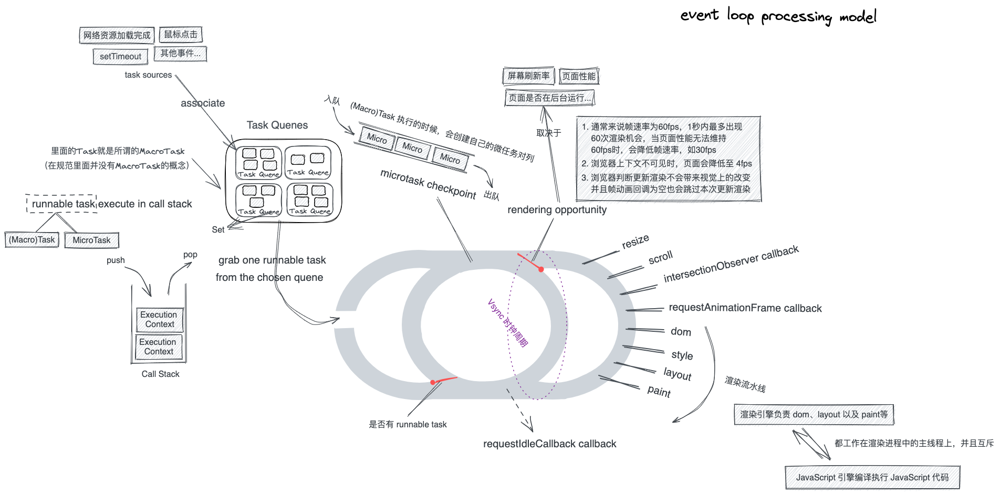
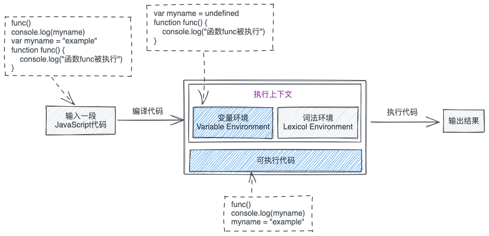
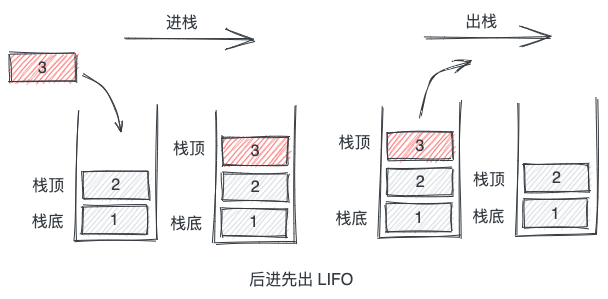
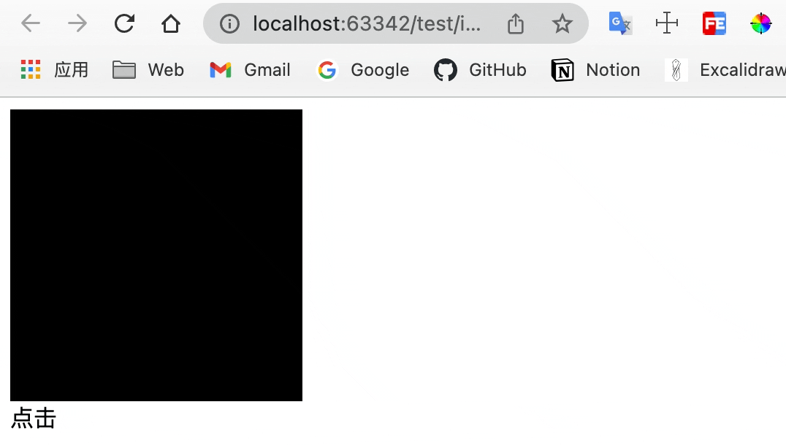
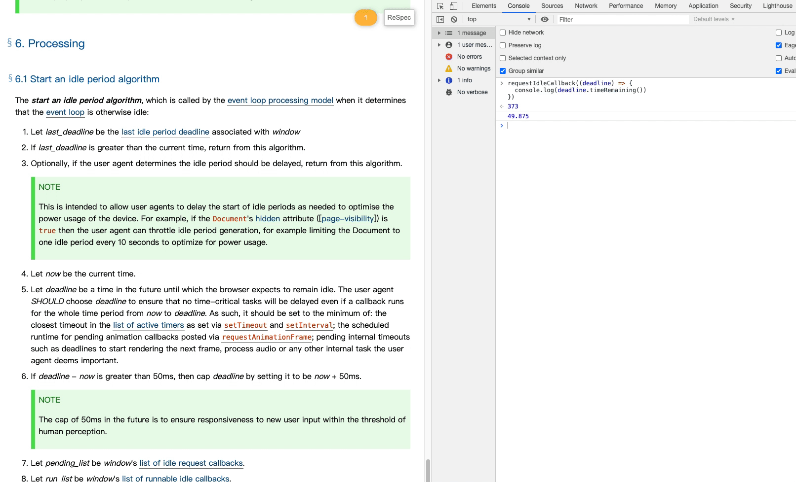

# Event Loop

> Event Loop 即事件循环，浏览器或者 Node 为协调事件、用户交互、脚本、渲染以及网络等任务执行顺序的一种机制



# 进程与线程

## 进程 Process
一个进程是一个程序运行的实例，启动一个程序的时候，操作系统会为该程序创建一块内存，用来存放代码、运行中的数据和执行任务的线程，我们把这样的一个运行环境叫进程。

## 线程 Thread
线程是不能单独存在的，其依附于进程，由进程来启动和管理。

## 进程和线程的关系
如果将 CPU（计算机的核心，负责承担计算机的计算任务）比喻为一个工厂，进程可视作为工厂的车间，它代表 CPU 所能处理的单个任务，而线程就像一个车间的工人，一个车间可以允许由多个工人协同完成一个任务。
1. 进程是操作系统分配资源的最小单位，线程是程序执行的最小单位；
2. 进程中的任意一线程执行出错，都会导致整个进程的崩溃
3. 当一个进程关闭之后，操作系统会回收进程所占用的内存；
4. 一个进程由一个或多个线程组成，线程是一个进程中代码的不同执行路线；
5. 线程上下问文的切换比进程上下问的切换要快得多;
6. 进程之间的内容相互隔离，但同一进程下的各个线程之间共享程序的内存空间(包括代码段、数据集、堆等)及一些进程级的资源(如打开文件和信号)；


单线程和多线程最简单的区别：单线程同一个时间只能做一件事情，而多线程同一个时间能做多件事情

# JavaScript 是单线程的语言

JavaScript 语言的一大特点就是单线程， 而之所以被设计为单线程是因为 JavaScript 作为浏览器脚本语言，其主要用途是与用户互动，以及操作 DOM。如果是多线程的话，假如 JavaScript 同时有两个线程，一个线程在某个 DOM 节点上添加内容，另一个线程删除了这个节点，这时浏览器应该以哪个线程为准？所以，为了避免复杂性，从诞生起，JavaScript 就是单线程，这已经成了这门语言的核心特征，将来也不会改变。

为了利用多核 CPU 的计算能力，HTML5 提出 Web Worker 标准，允许 JavaScript 脚本创建多个线程，但是子线程完全受主线程控制，且不得操作 DOM。所以，这个新标准并没有改变JavaScript 单线程的本质 。

# JavaScript 代码的执行


一段 JavaScript 代码在执行前需要先被 JavaScript 引擎编译，编译完成后，才会进行执行阶段，即**先编译，再执行。**

在代码经过编译后，会生成两部分内容：执行上下文（Execution context）和可执行代码。



## 执行上下文

执行上下文是执行一段 JavaScript 代码时的运行环境，是在代码执行（这儿的执行可理解为函数调用）的时候创建的，比如调用一个函数，就会进入这个函数的执行上下文，确定该函数在执行期间用到的诸如 this、变量、对象以及函数等。

那么哪些情况下代码才算是“一段” JavaScript 代码，才会在执行（这儿的执行是可执行代码中的执行）之前就进行编译并创建执行上下文，一般说来，有这么三种情况：

- 当 JavaScript 执行全局代码的时候，会编译全局代码并创建全局执行上下文，而且在整个页面的生存周期内，全局执行上下文只有一份;
- 当调用一个函数的时候，函数体内的代码会被编译，并创建函数执行上下文，一般情况下，函数执行结束之后，创建的函数执行上下文会被销毁;
- 当使用 eval 函数的时候，eval 的代码也会被编译，并创建执行上下文;

# 栈、队列


## 线性表

线性结构（线性表）是一个有序数据元素的集合。 其中数据元素之间的关系是一对一的关系，即除了第一个和最后一个数据元素之外，其它数据元素都是首尾相接的（这句话只适用大部分线性结构，而不是全部。比如，循环链表也是一种线性结构（在逻辑结构上属于链式存储结构），但是把最后一个数据元素的尾指针指向了首位结点））。

线性表具有一下特征：

- 集合中必存在唯一的一个“第一个元素”；
- 集合中必存在唯一的一个“最后的元素”；
- 除最后元素之外，其它数据元素均有唯一的“后继“；
- 除第一元素之外，其它数据元素均有唯一的”前驱“；

线性表又分为一般线性表和受限线性表，而栈和队列就属于受限线性表。

## 栈（Stack）

栈（Stack）是操作限定在表尾部进行的线性表，表尾称为栈顶（Top），另一端固定不动，称为栈底（Bottom）,具有 LIFO（后进先出，Last in First Out）的特点。



## 队列（Queue）

队列（Quene）是插入操作限定在表尾其他操作限定在表头的线性表，把进行插入操作的表尾称为队尾（Rear）,把进行其它操作的头部称为队首（Front），具有 FIFO（先进先出，First in First Out）的特点。


# 调用栈 Call Stack

函数调用时，JavaScript 引擎会为其创建执行上下文，那如果在函数中又调用了另外一个函数呢？JavaScript 引擎如何管理这些函数的执行上下文？这时就需要用到调用栈了（调用栈 Call Stack 和执行上下文栈 Execution Context Stack 是同一个东西，叫法不同而已）。

调用栈是用来管理执行上下文的一种数据结构（栈），通过调用栈能够追踪到哪个函数正在被执行以及各函数之间的调用关系，调用栈内存放的是代码执行期间的所有执行上下文。

- 每调用一个函数，JavaScript 引擎就会为其创建执行上下文，并把该执行上下文压入调用栈，然后 JavaScript 引擎开始执行函数代码；
- 如果在一个函数 funcA 中 调用了另外一个函数 funcB，那么 JavaScript 引擎会为 funcB 函数创建执行上下文，并将  funcB 函数的执行上下文压入调用栈；
- 当前函数执行完毕后，JavaScript 引擎会将该函数的执行上下文弹出栈；
- 调用栈有两个指标，最大栈容量和最大调用深度，当分配的调用栈超出任一指标时，会引发“堆栈溢出”问题；
- 全局执行上下文（默认/基础执行上下文在 JS 代码载入执行的时候即会被创建）会一直存在调用栈最底部，在页面退出关闭时才会出栈？ 🙄


# 关于同步和异步

同步和异步是针对代码执行后是否能立即拿到结果来讲的，或者说同步和异步是针对代码在执行过程中是否有阻塞来讲的。

## 同步（阻塞）

同步的意思是对于一段代码 JavaScript 引擎会严格按照单线程执行代码的规则（从上到下、从左到右），进行代码的编译和执行。

```javascript
const a = 1;
const b = 2;
const c = a + b;
console.log(c);
```

对于上面这段代码，在代码执行完之后，能立即拿到这段代码执行之后的结果，而且第 3 行的执行一定不会先于第 2 行和第 1 行执行，如果第 1 行或者第 2 行卡主了，那后面的第 3 行会被阻塞。

来看个更明显的例子：

```javascript
const a = 1;
const b = 2;
const d1 = Date.now();
let d2 = Date.now();
while (d2 - d1 < 2000) {
    d2 = Date.now();
}
// 这段代码在输出结果之前⽹⻚会进⼊⼀个类似假死的状态
console.log(a + b);
```

对于上面这段代码，在代码编译执行到第 4 行时，还是正常的速度执行，但是在下一行就会进入一个持续的循环中。因为 d2 和 d1 在⾏级间的时间差仅仅是毫秒内的差别，所以在执⾏到 while 循环的时候 d2 - d1 的值⼀定⽐ 2000 ⼩，那这个循环又会执⾏到什么时候呢？每次循环时 d2 都会获取⼀次当前的时间而发⽣变化，得等到 d2 - d1 >= 2000 时（这时也就是正好过了 2 秒的时间），才能跳出循环，进⽽再输出 a+b 的结果。那么这段代码的实际执⾏时间⾄少是2秒以上。在这里就出现了阻塞，这也是为什么将同步的代码运⾏机制叫做阻塞式运⾏的原因。

通俗来讲，同步就像你去食堂打饭，当前面的人还没打完饭，你就得等着，当排到你的时候，你才能打着饭，其实你排这个队（发起调用，或者说执行一段代码），也就是为了打个饭，目的在排到你这儿时达成（拿到结果）。

## 异步（非阻塞）

相较于同步来讲，在执行到异步模式中的代码那儿的时候不会立即拿到结果，在 JavaScript 引擎编译执行一段代码时，如果遇到异步模式的代码，引擎会将当前这块代码“挂起”并略过，继续向下执行非异步的代码。至于什么时候来执行之前”挂起”的那块代码，就涉及到事件循环了。

```javascript
const a = 1;
const b = 2;
fetch('/api/xxxx').then(function(response) {
  console.log(response)
});
// 这段代码会直接输出结果3并且要等fetch拿到响应后才会输出响应的内容
console.log(a + b);
```

上面这段代码，在执行到 fetch 的时候（请求会立即发出去），并不会立马就输出响应内容，这时 then 里面的回调会被“挂起”先略过，继续输出 a + b 的结果，在这儿并没有因为第 3 行的代码执行而阻塞 a + b 的输出，这也是为什么将异步的代码运⾏机制叫做非阻塞式运⾏的原因。

通俗来讲，异步就像你点了一份儿外卖（发起调用，或者说执行一段代码），你点了并不能马上就能吃上（并不能立即得到结果），那这会儿干等着吗？那可以继续打会儿游戏嘛（并不阻塞后面的代码执行），等外卖到了，再吃不就好了，游戏也打了，饭也吃上了。

# HTML 官方规范的摘录

> 在 [HTML 规范规范](https://html.spec.whatwg.org/multipage/webappapis.html#task-queue) 中并没有宏任务（MacroTask）这一概念，里面的 Task 就是通常所说的 MacroTask

1. Each [agent](https://tc39.es/ecma262/#sec-agents) has an associated event loop, which is unique to that agent
   
    每一个代理客户端都有一个与之关联的事件循环，并且唯一
    
2. The [event loop](https://html.spec.whatwg.org/multipage/webappapis.html#concept-agent-event-loop) of a [similar-origin window agent](https://html.spec.whatwg.org/multipage/webappapis.html#similar-origin-window-agent) is known as a window event loop. The [event loop](https://html.spec.whatwg.org/multipage/webappapis.html#concept-agent-event-loop) of a [dedicated worker agent](https://html.spec.whatwg.org/multipage/webappapis.html#dedicated-worker-agent), [shared worker agent](https://html.spec.whatwg.org/multipage/webappapis.html#shared-worker-agent), or [service worker agent](https://html.spec.whatwg.org/multipage/webappapis.html#service-worker-agent) is known as a worker event loop. And the [event loop](https://html.spec.whatwg.org/multipage/webappapis.html#concept-agent-event-loop) of a [worklet agent](https://html.spec.whatwg.org/multipage/webappapis.html#worklet-agent) is known as a worklet event loop
   
    根据代理/宿主的不同，事件循环又区分为window event loop、worker event loop、worklet event loop
    
3. An [event loop](https://html.spec.whatwg.org/multipage/webappapis.html#event-loop) has one or more task queues. A [task queue](https://html.spec.whatwg.org/multipage/webappapis.html#task-queue) is a [set](https://infra.spec.whatwg.org/#ordered-set) of [tasks](https://html.spec.whatwg.org/multipage/webappapis.html#concept-task).
   
    事件循环有一个或多个(宏)任务队列，每个(宏)任务队列是任务的集合
    
4. *[Task queues](https://html.spec.whatwg.org/multipage/webappapis.html#task-queue) are [sets](https://infra.spec.whatwg.org/#ordered-set), not [queues](https://infra.spec.whatwg.org/#queue), because [step one of the event loop processing model](https://html.spec.whatwg.org/multipage/webappapis.html#step1) grabs the first [runnable](https://html.spec.whatwg.org/multipage/webappapis.html#concept-task-runnable) [task](https://html.spec.whatwg.org/multipage/webappapis.html#concept-task) from the chosen queue, instead of [dequeuing](https://infra.spec.whatwg.org/#queue-dequeue) the first task*
   
    (宏)任务队列组是一个个集合而不是一个个队列，因为事件循环处理模型的第一步是从所选队列中抓取第一个可运行的(宏)任务，而不是将第一个任务出队（排在最前面的并不一定满足可运行条件）
    
5. For each [event loop](https://html.spec.whatwg.org/multipage/webappapis.html#event-loop), every [task source](https://html.spec.whatwg.org/multipage/webappapis.html#task-source) must be associated with a specific [task queue](https://html.spec.whatwg.org/multipage/webappapis.html#task-queue).
   
    For example, a user agent could have one [task queue](https://html.spec.whatwg.org/multipage/webappapis.html#task-queue) for mouse and key events (to which the [user interaction task source](https://html.spec.whatwg.org/multipage/webappapis.html#user-interaction-task-source) is associated), and another to which all other [task sources](https://html.spec.whatwg.org/multipage/webappapis.html#task-source) are associated. Then, using the freedom granted in the initial step of the [event loop processing model](https://html.spec.whatwg.org/multipage/webappapis.html#event-loop-processing-model), it could give keyboard and mouse events preference over other tasks three-quarters of the time, keeping the interface responsive but not starving other task queues. Note that in this setup, the processing model still enforces that the user agent would never process events from any one [task source](https://html.spec.whatwg.org/multipage/webappapis.html#task-source) out of order.
    
    不同类型的任务源对应着不同类型的任务队列（用于代理客户端可根据任务类型分配优享权等）
    
6. The [microtask queue](https://html.spec.whatwg.org/multipage/webappapis.html#microtask-queue) *is not a* [task queue](https://html.spec.whatwg.org/multipage/webappapis.html#task-queue)
   
    微任务队列不是(宏)任务队列（按上面的来讲，应该是 not a task set）
    
7. Each [event loop](https://html.spec.whatwg.org/multipage/webappapis.html#event-loop) has a microtask queue, which is a [queue](https://infra.spec.whatwg.org/#queue) of [microtasks](https://html.spec.whatwg.org/multipage/webappapis.html#microtask), initially empty. A microtask is a colloquial way of referring to a [task](https://html.spec.whatwg.org/multipage/webappapis.html#concept-task) that was created via the [queue a microtask](https://html.spec.whatwg.org/multipage/webappapis.html#queue-a-microtask) algorithm
   
    微任务队列是在(宏)任务被抓取执行时创建的任务的一种俗称，是一个队列，队列初始为空
    
8. Each [event loop](https://html.spec.whatwg.org/multipage/webappapis.html#event-loop) has a performing a microtask checkpoint boolean, which is initially false. It is used to prevent reentrant invocation of the [perform a microtask checkpoint](https://html.spec.whatwg.org/multipage/webappapis.html#perform-a-microtask-checkpoint) algorithm
   
    每个事件循环都有一个执行微任务检查点的，其为布尔值，初始为 false，以防止重复调用执行微任务检查点
    
9. Each [window event loop](https://html.spec.whatwg.org/multipage/webappapis.html#window-event-loop) has a `[DOMHighResTimeStamp](https://w3c.github.io/hr-time/#dom-domhighrestimestamp)` last render opportunity time, initially set to zero
   
    每个窗口事件循环都有一个 `[DOMHighResTimeStamp](https://w3c.github.io/hr-time/#dom-domhighrestimestamp)` 最后渲染机会时间，初始为零
    
    `[DOMHighResTimeStamp](https://w3c.github.io/hr-time/#dom-domhighrestimestamp)` 的值是一个双精度浮点数，它描述了两个时间点之间的经过的毫秒数（可以精确到5微秒，如果设备支持）
    
10. Each [window event loop](https://html.spec.whatwg.org/multipage/webappapis.html#window-event-loop) has a `[DOMHighResTimeStamp](https://w3c.github.io/hr-time/#dom-domhighrestimestamp)` last idle period start time, initially set to zero
    
    每个窗口事件循环都有一个`[DOMHighResTimeStamp](https://w3c.github.io/hr-time/#dom-domhighrestimestamp)` 最后空闲期开始时间，最初设置为零
    

# (宏)任务与微任务

常见(宏)任务：整个 JavaScript 代码、setTimeout、setInterval、setImmediate(Node) 等；

常见微任务：Promise.then/catch/finally、MutationOberver(浏览器)、process.nextTick(Node)等；

关于宏任务与微任务，举个例子，在去银行办理业务时，每个人都需要在进入银行时在取票机进行取票，普通客户拿到普通的号，VIP 客户拿着专门的 VIP 号，这个操作会把来办理业务的人按照特定的规则排队（这个操作就像不同的 task source 对应着不同的 task queen，再次强调 task queen 是集合而不是队列！）。假设银行只有一个办事窗口，窗口的工作人员会按照特定的规则（比如优先处理 VIP 客户）叫号，被叫到号码的人（这儿的人就相当于 task）就可以前往窗口（这儿的窗口就相当于 call stack）办理业务（这儿的办理业务就相当于任务代码放入  call stack 执行），在被叫到号的人在办理业务的过程中，后面的人都需要进行等待，等待下一次叫号（相当于下一轮的 event loop）。而每个人在窗口办理的业务内容各不相同，比如第一个人仅仅进行开卡的操作，在银行卡开通完毕后，银行的工作人员不会立即喊下一个号，而是会询问第一个人“您是否需要为刚才开通的卡办理⼀些增值业务，⽐如做个活期储蓄”（这就相当于 Perform a microtask checkpoint 执行微任务检查点），这时如果这个人想做个活期储蓄，银行工作人员喊这个人重新去取个号排队的话，那这个人大概率是不会办这个活期储蓄了，这样一来的话，银行的办事效率业务绩效都会下降，所以银行实际的做法是在叫下一个人办理业务前，如果前面的人临时有新的业务要办理，工作人员会继续为其办理业务，直到这个人的所有事情办理完毕（相当于在任务执行过程中产生的所有微任务会在这一轮的 event loop 中执行完毕），待这个人的所有业务办理完毕后，叫下一个号，下个人再到银行窗口办理业务。

# 事件循环模型

根据 [HTML 官方规范](https://html.spec.whatwg.org/multipage/webappapis.html#event-loop) 对于事件循环模型的定义，事件循环模型会不断的重复运行以下步骤（An [event loop](https://html.spec.whatwg.org/multipage/webappapis.html#event-loop) must continually run through the following steps for as long as it exists）：

*注：下面步骤中有部分省略了......*

1. 从(宏)任务队列中，按照入队顺序，找到第一个可执行的(宏)任务并设置为事件循环中正在执行的任务
   
   > 1. Let taskQueue be one of the [event loop](https://html.spec.whatwg.org/multipage/webappapis.html#event-loop)'s [task queues](https://html.spec.whatwg.org/multipage/webappapis.html#task-queue), chosen in an [implementation-defined](https://infra.spec.whatwg.org/#implementation-defined) manner, with the constraint that the chosen task queue must contain at least one [runnable](https://html.spec.whatwg.org/multipage/webappapis.html#concept-task-runnable) [task](https://html.spec.whatwg.org/multipage/webappapis.html#concept-task). If there is no such task queue, then jump to the *microtasks* step below【选取一个可执行的(宏)任务队列，如果没有则跳至下面第3步】
   > 1. Let oldestTask be the first runnable task in taskQueue, and remove it from taskQueue
   > 1. Set the event loop's currently running task to oldestTask
   
2. 将该(宏)任务放入调用栈并执行，执行完该(宏)任务中所有同步代码后，即调用栈清空后（忽略全局执行上下文），该(宏)任务被推出宏任务队列

   > 1. Let taskStartTime be the [current high resolution time](https://w3c.github.io/hr-time/#dfn-current-high-resolution-time)【设置任务开始时间为一个高精度的时间（双精度的浮点数，可以精确的微秒，就是 [DOMHighResTimeStamp](https://w3c.github.io/hr-time/#dom-domhighrestimestamp) ）】
   > 1. Perform oldestTask's [steps](https://html.spec.whatwg.org/multipage/webappapis.html#concept-task-steps)【放入调用栈执行】
   > 1. Set the [event loop](https://html.spec.whatwg.org/multipage/webappapis.html#event-loop)'s [currently running task](https://html.spec.whatwg.org/multipage/webappapis.html#currently-running-task) back to null【设置事件循环中当前正在执行的任务为空】

3. 检查微任务队列，执行并清空微任务队列，如果在微任务的执行中又加入了新的微任务，也会在这一步一起执行；

    > *Microtasks*: [Perform a microtask checkpoint](https://html.spec.whatwg.org/multipage/webappapis.html#perform-a-microtask-checkpoint)【执行微任务检查点】
    >
    > 1. If the [event loop](https://html.spec.whatwg.org/multipage/webappapis.html#event-loop)'s [performing a microtask checkpoint](https://html.spec.whatwg.org/multipage/webappapis.html#performing-a-microtask-checkpoint) is true, then return 【如果事件循环中的微任务检查点为 ture，直接略过】
    > 2. Set the [event loop](https://html.spec.whatwg.org/multipage/webappapis.html#event-loop)'s [performing a microtask checkpoint](https://html.spec.whatwg.org/multipage/webappapis.html#performing-a-microtask-checkpoint) to true【设置事件循环中的微任务检查点为 true】
    > 3. While the [event loop](https://html.spec.whatwg.org/multipage/webappapis.html#event-loop)'s [microtask queue](https://html.spec.whatwg.org/multipage/webappapis.html#microtask-queue) is not [empty](https://infra.spec.whatwg.org/#list-is-empty)【当事件循环中的微任务队列不为空的时候】
    >    1. Let oldestMicrotask be the result of [dequeuing](https://infra.spec.whatwg.org/#queue-dequeue) from the [event loop](https://html.spec.whatwg.org/multipage/webappapis.html#event-loop)'s [microtask queue](https://html.spec.whatwg.org/multipage/webappapis.html#microtask-queue)，Set the [event loop](https://html.spec.whatwg.org/multipage/webappapis.html#event-loop)'s [currently running task](https://html.spec.whatwg.org/multipage/webappapis.html#currently-running-task) to oldestMicrotask.【将最先入微任务队列中的微任务出队并将其设置为事件循环中正在执行的任务】
    >    2. Run oldestMicrotask(*This might involve invoking scripted callbacks, which eventually calls the [clean up after running script](https://html.spec.whatwg.org/multipage/webappapis.html#clean-up-after-running-script) steps, which call this [perform a microtask checkpoint](https://html.spec.whatwg.org/multipage/webappapis.html#perform-a-microtask-checkpoint) algorithm again, which is why we use the [performing a microtask checkpoint](https://html.spec.whatwg.org/multipage/webappapis.html#performing-a-microtask-checkpoint) flag to avoid reentrancy*)【执行该微任务，如果在这一步中又产生了新的微任务，按入队顺序依次执行直至该微任务队列清空】
    >    3. Set the [event loop](https://html.spec.whatwg.org/multipage/webappapis.html#event-loop)'s [currently running task](https://html.spec.whatwg.org/multipage/webappapis.html#currently-running-task) back to null【设置事件循环中当前正在执行的任务为空】
    > 4. [Cleanup Indexed Database transactions](https://w3c.github.io/IndexedDB/#cleanup-indexed-database-transactions)......【清空索引数据库事务吧啦吧啦...】
    > 5. Set the [event loop](https://html.spec.whatwg.org/multipage/webappapis.html#event-loop)'s [performing a microtask checkpoint](https://html.spec.whatwg.org/multipage/webappapis.html#performing-a-microtask-checkpoint) to false 【设置事件循环中的微任务检查点为 false】

4. 设置 hasARenderingOpportunity 为 false【Let hasARenderingOpportunity be false】

5. 设置当前时间为一个高精度时间【Let now be the [current high resolution time](https://w3c.github.io/hr-time/#dfn-current-high-resolution-time)】

6. 通过任务开始时间（taskStartTime）、当前时间（now）等条件得出任务持续时间

    >  Report the [task](https://html.spec.whatwg.org/multipage/webappapis.html#concept-task)'s duration by performing the following steps
    >
    > 1. Let top-level browsing contexts be an empty [set](https://infra.spec.whatwg.org/#ordered-set)
    > 2. For each [environment settings object](https://html.spec.whatwg.org/multipage/webappapis.html#environment-settings-object) settings of oldestTask's [script evaluation environment settings object set](https://html.spec.whatwg.org/multipage/webappapis.html#script-evaluation-environment-settings-object-set), [append](https://infra.spec.whatwg.org/#set-append) setting's [top-level browsing context](https://html.spec.whatwg.org/multipage/browsers.html#top-level-browsing-context) to top-level browsing contexts
    > 3. [Report long tasks](https://w3c.github.io/longtasks/#report-long-tasks), passing in taskStartTime, now (the end time of the task), top-level browsing contexts, and oldestTask

7. 进入更新渲染阶段，判断是否需要渲染，在这里有个  [rendering opportunity(渲染时机)](https://html.spec.whatwg.org/multipage/webappapis.html#rendering-opportunity) 的概念，并不一定每一轮 event loop 都会对应一次浏览器渲染

    > 1. *Rendering opportunities*: Remove from docs all [Document](https://html.spec.whatwg.org/multipage/dom.html#document) objects whose [browsing context](https://html.spec.whatwg.org/multipage/browsers.html#concept-document-bc) do not have a [rendering opportunity](https://html.spec.whatwg.org/multipage/webappapis.html#rendering-opportunity)【如果判断当前文档不需要渲染，则移除所有 docs，不进入更新渲染】
    >    1. [Browsing context](https://html.spec.whatwg.org/multipage/browsers.html#browsing-context) [rendering opportunities](https://html.spec.whatwg.org/multipage/webappapis.html#rendering-opportunity) are determined based on hardware constraints such as display refresh rates and other factors such as page performance or whether the document's [visibility state](https://html.spec.whatwg.org/multipage/interaction.html#visibility-state) is "`visible`". Rendering opportunities typically occur at regular intervals【rendering opportunity 取决于屏幕刷新率、页面性能以及页面是否在后台运行等因素， rendering opportunity 通常来说是定期出现的】
    >
    >    2. This specification does not mandate any particular model for selecting rendering opportunities. But for example, if the browser is attempting to achieve a 60Hz refresh rate, then rendering opportunities occur at a maximum of every 60th of a second (about 16.7ms). If the browser finds that a [browsing context](https://html.spec.whatwg.org/multipage/browsers.html#browsing-context) is not able to sustain this rate, it might drop to a more sustainable 30 rendering opportunities per second for that [browsing context](https://html.spec.whatwg.org/multipage/browsers.html#browsing-context), rather than occasionally dropping frames.【如果屏幕刷新率为 60Hz，浏览器会试图达到 60fps 的帧速率，也就是浏览器在1秒内最多会出现 60 次的渲染机会，也就是每隔 16.7ms 会出现1次渲染时机，并且浏览器会尽可能的保持帧速率稳定，例如页面性能无法维持 60fps 的话，那么浏览器就会选择 30fps 的帧速率以避免偶尔丢帧（虽然可能不如 60fps 流畅会有些许卡顿，但至少能保证不丢帧）】
    >
    >       *关于屏幕刷新率和浏览器帧速率，请看下面章节【[屏幕刷新率与浏览器帧速率](https://www.notion.so/Event-Loop-b027477804d04c938a0aad91d372a900)】*
    >
    >    3. Similarly, if a [browsing context](https://html.spec.whatwg.org/multipage/browsers.html#browsing-context) is not visible, the user agent might decide to drop that page to a much slower 4 rendering opportunities per second, or even less【如果浏览器上下文不可见，那么页面会降低到 4fps 左右的帧速率甚至更低（1秒内最多出现 4 次渲染时机）】
    >
    > 2. If docs is not empty, then set hasARenderingOpportunity to true and set this [event loop](https://html.spec.whatwg.org/multipage/webappapis.html#event-loop)'s [last render opportunity time](https://html.spec.whatwg.org/multipage/webappapis.html#last-render-opportunity-time) to taskStartTime【如果要 docs 不为空，需要进入更新渲染，设置 hasARenderingOpportunity 为 true】
    >
    > 3. Unnecessary rendering: Remove from docs all [Document](https://html.spec.whatwg.org/multipage/dom.html#document) objects which meet both of the following conditions【如果以下条件都满足，也会跳过更新渲染】
    >
    >    1. The user agent believes that updating the rendering of the [Document](https://html.spec.whatwg.org/multipage/dom.html#document)'s [browsing context](https://html.spec.whatwg.org/multipage/browsers.html#concept-document-bc) would have no visible effec【浏览器判断更新渲染不会带来视觉上的改变】
    >
    >    2. the [Document](https://html.spec.whatwg.org/multipage/dom.html#document)'s [map of animation frame callbacks](https://html.spec.whatwg.org/multipage/imagebitmap-and-animations.html#list-of-animation-frame-callbacks) is empty 【帧动画回调为空（可以通过 `requestAnimationFrame`  来请求帧动画）】
    >
    >       这段是对上面这个 [map of animation frame callbacks](https://html.spec.whatwg.org/multipage/imagebitmap-and-animations.html#list-of-animation-frame-callbacks)  一个释义：Each [target object](https://html.spec.whatwg.org/multipage/imagebitmap-and-animations.html#concept-animationframeprovider-target-object) has a map of animation frame callbacks, which is an [ordered map](https://infra.spec.whatwg.org/#ordered-map) that must be initially empty, and an animation frame callback identifier, which is a number that must initially be zero，从释义可以看出 map of animation frame callbacks 的这个 map 是一个[有序的 Map 结构](https://infra.spec.whatwg.org/#ordered-map) ！！！
    >
    > 4. the user agent believes that it's preferrable to skip updating the rendering for other reasons【代理客户端判定因为其他原因，最好跳过更新渲染】
    >
    >    1. This step enables the user agent to prevent the steps below from running for other reasons, for example, to ensure certain [tasks](https://html.spec.whatwg.org/multipage/webappapis.html#concept-task) are executed immediately after each other, with only [microtask checkpoints](https://html.spec.whatwg.org/multipage/webappapis.html#perform-a-microtask-checkpoint) interleaved (and without, e.g., [animation frame callbacks](https://html.spec.whatwg.org/multipage/imagebitmap-and-animations.html#run-the-animation-frame-callbacks) interleaved). Concretely, a user agent might wish to coalesce timer callbacks together, with no intermediate rendering updates【有时浏览器希望两次定时器任务是合并的，它们之间只会穿插这微任务的执行，而不会穿插屏幕渲染相关的流程（比如 requestAnimationFrame）】
    
8. 如果在上面第 7 步，浏览器判断这一次事件循环不需要更新渲染，那下面9步到13步也会跳过

9. 对于需要渲染的文档，如果窗口的大小发生了变化，执行监听的 resize 方法【For each [fully active](https://html.spec.whatwg.org/multipage/browsers.html#fully-active) [Document](https://html.spec.whatwg.org/multipage/dom.html#document) in docs, [run the resize steps](https://drafts.csswg.org/cssom-view/#run-the-resize-steps) for that [Document](https://html.spec.whatwg.org/multipage/dom.html#document)[[CSSOMVIEW]](https://html.spec.whatwg.org/multipage/references.html#refsCSSOMVIEW)】

10. 对于需要渲染的文档，如果页面发生了滚动，执行 scroll 方法【For each [fully active](https://html.spec.whatwg.org/multipage/browsers.html#fully-active) [Document](https://html.spec.whatwg.org/multipage/dom.html#document) in docs, [run the scroll steps](https://drafts.csswg.org/cssom-view/#run-the-scroll-steps) for that [Document](https://html.spec.whatwg.org/multipage/dom.html#document)[[CSSOMVIEW]](https://html.spec.whatwg.org/multipage/references.html#refsCSSOMVIEW)】
    > 对于 resize 和 scroll 来说，并不是到了这一步才去执行滚动和缩放，那岂不是要延迟很多？浏览器当然会立刻帮你滚动视图，根据 [CSSOM 规范](https://drafts.csswg.org/cssom-view/#scrolling-events) 所讲，浏览器会保存一个 [pending scroll event targets](https://drafts.csswg.org/cssom-view/#pending-scroll-event-targets)，等到事件循环中的 scroll 这一步，去派发一个事件到对应的目标上，驱动它去执行监听的回调函数而已，resize 也是同理
    而且因为 rendering opportunity 的缘故，而 rendering opportunity 通常来说是定期出现的（每 16.7ms 出现一次），所以 resize 和 scroll 事件s是自带节流的，它只在 event loop 的更新渲染阶段去派发事件到 EventTarget 上

11. 对于需要渲染的文档，执行帧动画回调，即 requestAnimationFrame 的回调【For each [fully active](https://html.spec.whatwg.org/multipage/browsers.html#fully-active) [Document ](https://html.spec.whatwg.org/multipage/dom.html#document)in docs, [run the animation frame callbacks](https://html.spec.whatwg.org/multipage/imagebitmap-and-animations.html#run-the-animation-frame-callbacks) for that [Document](https://html.spec.whatwg.org/multipage/dom.html#document)】

12. 对于需要渲染的文档，执行 IntersectionObserver 的回调【For each [fully active](https://html.spec.whatwg.org/multipage/browsers.html#fully-active) [Document](https://html.spec.whatwg.org/multipage/dom.html#document)in docs, [run the update intersection observations steps](https://w3c.github.io/IntersectionObserver/#run-the-update-intersection-observations-steps) for that [Document](https://html.spec.whatwg.org/multipage/dom.html#document)】

13. 对于需要渲染的文档，重新渲染绘制用户界面【For each [fully active](https://html.spec.whatwg.org/multipage/browsers.html#fully-active) [Document](https://html.spec.whatwg.org/multipage/dom.html#document) in docs, update the rendering or user interface of that [Document](https://html.spec.whatwg.org/multipage/dom.html#document) and its [browsing context](https://html.spec.whatwg.org/multipage/browsers.html#concept-document-bc) to reflect the current state】 [渲染流水线](https://github.com/llaurora/KnowledgeNote/blob/master/%E6%B5%8F%E8%A7%88%E5%99%A8%E7%BD%91%E7%BB%9C/%E6%B8%B2%E6%9F%93%E6%B5%81%E6%B0%B4%E7%BA%BF.md) 

14. 如果是浏览器窗口事件循环、没有(宏)任务、微任务队列为空并且 hasARenderingOpportunity 为 false 的话，则依据 computeDeadline 以启动空闲期算法，即 [requestIdleCallback](https://w3c.github.io/requestidlecallback/)

     > If all of the following are true
     >
     > - this is a [window event loop](https://html.spec.whatwg.org/multipage/webappapis.html#window-event-loop)【是浏览器窗口事件循环，即浏览器中的事件循环所独有的环节】
     > - there is no [task](https://html.spec.whatwg.org/multipage/webappapis.html#concept-task) in this [event loop](https://html.spec.whatwg.org/multipage/webappapis.html#event-loop)'s [task queues](https://html.spec.whatwg.org/multipage/webappapis.html#task-queue) whose [document](https://html.spec.whatwg.org/multipage/webappapis.html#concept-task-document) is [fully active](https://html.spec.whatwg.org/multipage/browsers.html#fully-active)【没有(宏)任务】
     > - this [event loop](https://html.spec.whatwg.org/multipage/webappapis.html#event-loop)'s [microtask queue](https://html.spec.whatwg.org/multipage/webappapis.html#microtask-queue) is [empty](https://infra.spec.whatwg.org/#list-is-empty)【微任务队列为空】
     > - hasARenderingOpportunity is false 【hasARenderingOpportunity 为 false】
     >
     > then:
     >
     > 1. Let computeDeadline be the following steps【通过一系列步骤得出 computeDeadline】
     > 2. For each win of the [same-loop windows](https://html.spec.whatwg.org/multipage/webappapis.html#same-loop-windows) for this [event loop](https://html.spec.whatwg.org/multipage/webappapis.html#event-loop), perform the [start an idle period algorithm](https://w3c.github.io/requestidlecallback/#start-an-idle-period-algorithm) for win with computeDeadline.[[REQUESTIDLECALLBACK]](https://html.spec.whatwg.org/multipage/references.html#refsREQUESTIDLECALLBACK)【依据 computeDeadline 以启动空闲期算法】

# 屏幕刷新率与浏览器帧速率

屏幕刷新率是指显示器读取帧图的频率，与显示器的屏幕有关，而与浏览器窗口是否是活动的没有关系，通常来说屏幕的刷新率为 60Hz，每隔 1/60 秒会读取一次帧图，具体来讲显示器每隔 1/60 秒读取一次存放于显卡前缓冲区的帧图。

浏览器帧速率是指浏览器的渲染进程生成一帧的速度，与浏览器窗口是否是活动的以及显卡性能等因素有关，通常为 60fps，1秒内生成 60 张帧图，浏览器会将新生成的帧图提交到显卡的后缓冲区，然后 GPU 将后缓冲区和前缓冲区互换位置，也就是前缓冲区变成了后缓冲区，后缓冲区变成了前缓冲区，这样一来保证显示器下次能读取到 GPU 中最新的图片。

这两者往往是同步的，通常来讲，屏幕 60Hz 的刷新率对应着浏览器 60fps 的刷新率（只是通常来讲，但比如页面性能你无法维持 60fps 的话，浏览器会选择 30fps 的帧速率以避免掉帧）。如果这两者不同步会造成一些问题：

- 如果渲染进程生成的帧速比屏幕的刷新率慢，那么屏幕会在两帧中显示同一个画面，当这种断断续续的情况持续发生时，用户将会很明显地察觉到画面卡顿（60Hz 的刷新率和 30fps 的帧速率，显示器每隔 16.7ms 读取一次帧图，但这时浏览器生成一张帧图需要 1/60 * 2 s即 16.7ms *2 = 33.4 ms）；
- 如果渲染进程生成的帧速率比屏幕刷新率快，那么也会出现一些视觉上的问题，比如当帧速率在 100fps 而刷新率只有 60Hz 的时候，GPU 所渲染的图像并非全都被显示出来，这就会造成丢帧现象

# 小结

1. 规范里面怎么定义宏任务的？
   
    首先规范里面并没有关于宏任务(MarcoTask)的概念，只是大家为便于和微任务区分开，通俗的把除开微任务外的任务称为宏任务(MacroTask)。
    
2. 宏任务与微任务是在一个维度吗？
   
    微任务队列是在(宏)任务被抓取执行时创建的任务的一种俗称，是一个队列，队列初始为空（可以将微任务看做是(宏)任务的小尾巴）。
    
3. 宏任务队列和微任务队列是队列吗？
   
    (宏)任务队列是集合而不是队列，微任务队列是队列且初始为空。
    
4. 只存在一个宏任务队列吗？
   
    事件循环有一个或多个(宏)任务队列，不同的任务队列关联着不同类型的任务源。
    
5. 每一轮事件循环一定伴随着渲染更新吗？
   
    每一轮事件循环并一定伴随着渲染更新，但是如果有微任务，一定会伴随着微任务的执行。
    
6. (宏)任务之间一定会执行穿插其间的渲染流程吗？
   
    并不一定，比如两个定时器任务，浏览器考虑到屏幕刷新率、页面性能等因素可能会合并定时器任务，会执行穿插的微任务，但不一定会执行穿插的渲染流程。
    

# requestAnimationFrame

根据 [MDN 文档](https://developer.mozilla.org/zh-CN/docs/Web/API/Window/requestAnimationFrame)  上对 requestAnimationFrame 的定义，requestAnimationFrame 是告诉浏览器你希望执行一个动画，并且要求浏览器在下次重绘之前调用指定的回调函数更新动画。该方法需要传入一个回调函数作为参数，该回调函数会在浏览器下一次重绘之前执行，并且若你想在浏览器下次重绘之前继续更新下一帧动画，那么回调函数自身必须再次调用 requestAnimationFrame。

调用 requestAnimationFrame 会返回一个请求 ID，用于标识在回调函数列表中的唯一性，可以将 ID 传给 [cancelAnimationFrame](https://developer.mozilla.org/zh-CN/docs/Web/API/Window/cancelAnimationFrame) 以取消回调函数。

## rAF 的执行时机

准确来说，应该是 rAF 回调函数的执行时机，根据  [MDN 文档](https://developer.mozilla.org/zh-CN/docs/Web/API/Window/requestAnimationFrame)  可以得出其是在下次重绘之前执行，根据上面的 [事件循环模型](https://github.com/llaurora/KnowledgeNote/blob/master/%E6%B5%8F%E8%A7%88%E5%99%A8%E7%BD%91%E7%BB%9C/Event%20Loop.md) 具体来说，rAF 的回调执行时机（得以执行的前提是得有 rendering opportunity 并且 [map of animation frame callbacks](https://html.spec.whatwg.org/multipage/imagebitmap-and-animations.html#list-of-animation-frame-callbacks)  不为空，至于这个 map 上面有解释过）是在微任务之后，重新执行渲染之前。

由于需要进入到 [更新渲染](https://github.com/llaurora/KnowledgeNote/blob/master/%E6%B5%8F%E8%A7%88%E5%99%A8%E7%BD%91%E7%BB%9C/Event%20Loop.md) 阶段，才有得以执行的机会，渲染时机（rendering opportunities）又与屏幕刷新率、页面性能等有关系，一般来说屏幕刷新率 60Hz，也就是每隔 16.7ms 轮得到一次进入更新渲染的机会，但不管是否在这一次 event loop 中有进入到更新渲染，但 rAF 的回调一定是在页面重新绘制前执行（给了你最后一次可更改渲染效果的机会），这能保证在 rAF 回调里对渲染效果做的更改，能在页面重新绘制的时候立马生效。

而用 setTimeout 做 JavaScript 动画的话，无论如何，该 setTimeout 的回调都在下一轮事件循环中去了，而又因为可能要执行了其他优先级更高的任务，setTimeout 的回调会被阻塞，即使不阻塞，浏览器出于性能考虑等因素，两次(宏)任务可能会合并，也就是中间不一定穿插有渲染相关的流程，并不稳定，后面通过例子细讲。

## rAF 与 setTimeout

```jsx
const element = document.querySelector("#btn");
element.addEventListener("click", () => {
    setTimeout(() => {
        console.log("timeoutCallback");
    });
    requestAnimationFrame(() => {
        console.log("rAFCallback");
    });
    console.log("---------------------");
});
```

上面这段代码在点击的时候，输出顺序是什么？分隔线也就是第9步肯定是最先执行的，这个毋庸置疑，关键是 setTimeout 的回调和 rAF 的回调谁先执行谁后执行？

多点击几次，你会发现，有时是先执行 setTimeout 的回调，有时又是先执行 rAF 的回调


之所以会出现这两种情况，最主要的还是跟 [rendering opportunities](https://html.spec.whatwg.org/multipage/webappapis.html#rendering-opportunity) 有关系，在点击事件触发时，() ⇒ {...} 整个代码作为一个(宏)任务被事件循环抓取执行，先输出分隔线，setTimeout 的回调会在 4ms 后进入(宏)任务队列（setTimeout 有一个最小延迟时间，具体的请查看 [MDN](https://developer.mozilla.org/zh-CN/docs/Web/API/setTimeout)），而 rAF 的回调得在事件循环进入到 [更新渲染阶段](https://github.com/llaurora/KnowledgeNote/blob/master/%E6%B5%8F%E8%A7%88%E5%99%A8%E7%BD%91%E7%BB%9C/Event%20Loop.md) 才能得以执行，也就是在这一轮事件循环中不一定进入得到更新渲染流程，也就不一定得以执行 rAF 的回调，下面分情况描述以下具体过程：

1. rAFCallback 先、timeoutCallback 后
   
    在执行() ⇒ {...} 的时候，4ms 后 timeoutCallback 被放进(宏)任务队列，而进入到更新渲染阶段的时候，刚好碰上了出现 [rendering opportunities](https://html.spec.whatwg.org/multipage/webappapis.html#rendering-opportunity) 的时机（距离上一次渲染时机过了 16.7ms），则在这一次事件循环中，就立马执行了 rAFCallback，然后再在下一次事件循环中执行 timeoutCallback
    
2. rAFCallback 后、timeoutCallback 先
   
    在执行() ⇒ {...} 的时候，4ms 后 timeoutCallback 被放进(宏)任务队列，而进入到更新渲染阶段的时候，这时没碰上出现 [rendering opportunities](https://html.spec.whatwg.org/multipage/webappapis.html#rendering-opportunity) 的时机（距离上一次渲染时机可能才过了 8ms，显示器从前缓冲区读取帧图才过去 8ms ），则在这一次事件循环中，就会跳过更新渲染，然后在下一次事件循环中执行 timeoutCallback，然后又进入更新渲染阶段，看这个时候轮到出现 [rendering opportunities](https://html.spec.whatwg.org/multipage/webappapis.html#rendering-opportunity) 的时机没，轮到了就执行 rAFCallback，没轮到的话就又后面去了，但总归是 rAFCallback 后、timeoutCallback 先了
    

再看一下分别用 setTimeout 做的动画和用 rAF 做的动画

```javascript
const element = document.querySelector("#animationExample");
const btn = document.querySelector("#btn");
let requestId;
let i = 0;
const animation = ()=> {
    element.style.marginLeft = `${i}px`;
    requestId = requestAnimationFrame(animation);
    i += 1;
    if (i > 200) {
        cancelAnimationFrame(requestId);
    }
}
btn.addEventListener("click", animation);
```

因为屏幕刷新率一般为 60Hz，又没其他因素影响，所以上面的 animation 代码每隔 16.7 ms 执行一次（每隔 16.7ms 有一次进入更新渲染的机会），能确切的保证 marginLeft 的值和上一次更新渲染 marginLeft 的差值是 1px（注意区分下面 setTimeout 的例子，浏览器是有可能会合并 setTimeout 的）



然后再来看下用 setTimeout 来实现（setTimeout 有一个最小延迟时间，所以虽然将 setTimeout 的延迟设置为 0，但是无论如何都有约 4ms 的延迟，大体上也不影响模拟）

```javascript
const element = document.querySelector("#animationExample");
const btn = document.querySelector("#btn");
let timerId;
let i = 0;
const animation = ()=> {
    element.style.marginLeft = `${i}px`;
		// 执行间隔设置为 0，来模拟 requestAnimationFrame
    timerId = setTimeout(animation, 0);
    i += 1;
    if (i > 200) {
        clearTimeout(timerId);
    }
}
btn.addEventListener("click", animation);
```


对比用 setTimeout 做的动画和用 rAF 做的动画，代码实现方式上基本没啥区别，但能明显的看出 setTimeout 比 rAF 实现的动画“快”了很多，而这里面的原因正是由于事件循环中有个渲染时机（rendering opportunity），不一定每一次事件循环都会伴随一次更新渲染，浏览器考虑到屏幕刷新率、页面性能等因素，有可能会合并多个 setTimeout callback，不会执行穿插在 setTimeout callback 间的渲染流程，所以有可能在 setTimeout callback 执行了几次之后才进行更新渲染，此时设置的 marginLeft 和上一次更新渲染前的 marginLeft 的差值要大于 1px，所以肉眼看起来”快”了很多，也正是因为浏览器可能会合并多个 setTimeout callback，所以用 setTimeout callback 做 JavaScript 动画是不稳定的，要做 JavaScript 动画还是推荐用 rAF。

同样因为浏览器可能会合并多个 setTimeout callback，所以下面这段代码的输出顺序是 sto、sto、rAF、rAF 也就容易理解了

```javascript
setTimeout(() => {
  console.log("sto")
  requestAnimationFrame(() => console.log("rAF"))
})
setTimeout(() => {
  console.log("sto")
  requestAnimationFrame(() => console.log("rAF"))
})
```

# requestIdleCallback

根据 [MDN 文档](https://developer.mozilla.org/zh-CN/docs/Web/API/Window/requestIdleCallback)，requestIdleCallback 目前还是一个实验中的功能，还没有标准化，意图是让我们把一些计算量较大但是又没那么紧急的任务放到空闲时间去执行，而又不影响浏览器中优先级较高的任务，比如动画绘制、用户输入等。

requestIdleCallback 参数说明：window.requestIdleCallback(callback[, options]); 

- callback：一个在事件循环空闲时被调用的函数。函数会接收到一个名为 `[IdleDeadline](https://developer.mozilla.org/zh-CN/docs/Web/API/IdleDeadline)` 的参数，这个参数可以获取当前空闲时间（IdelDeadline.timeRemaining()，该返回值是一个高精度时间 `[DOMHighResTimeStamp](https://w3c.github.io/hr-time/#dom-domhighrestimestamp)` ）以及回调是否在超时时间前已经执行的状态（IdelDeadline.didTimeout，这是一个布尔值）
- options(可选)：可选的配置参数，有一个 timeout 的属性，如果指定了 timeout，并且有一个正值，而回调在timeout毫秒过后还没有被调用，那么回调任务将放入事件循环中排队（放入 task queen），即使这样做有可能对性能产生负面影响

从 Vsync 时钟周期，帧图读取这个周期的角度来看的话，在两帧之间包含用户交互、JavaScript  的执行、布局计算及页面重绘等工作（就是事件循环那一套），假如屏幕刷新率为 60Hz，Vsync 的时钟周期为 16.7ms，如果在某一帧里执行完上面步骤（即来到 [事件循环处理模型的第 14 步](https://github.com/llaurora/KnowledgeNote/blob/master/%E6%B5%8F%E8%A7%88%E5%99%A8%E7%BD%91%E7%BB%9C/Event%20Loop.md) ），还不到 16.7 ms，那么这一帧就会有一定的空闲时间，这段空闲期就恰好可以用来执行 requestIdlCallback 的回调（执行的时候浏览器会通过  [idle period algorithm(空闲期算法)](https://w3c.github.io/requestidlecallback/#start-an-idle-period-algorithm) 得出 deadline，然后给到 requestIdleCallback 的回调 callback？），下图为渲染有序进行（浏览器 - 用户 - 浏览器 - 用户）时 idle period(空闲期) 的一个示意：


如果在几帧的时间内浏览器都是空闲的，并没有发生任何影响视图的操作，这个时候渲染长期空闲：


之所以有一个 50ms 的 deadline，是根据研究得出的，研究表明，人们通常认为 100ms 内对用户输入的响应是瞬时的。 将闲置截止期限设置为 50ms 意味着即使在闲置任务开始后立即发生用户输入，浏览器仍然有剩余的 50ms 可以在其中响应用户输入而不会产生用户可察觉的滞后。

在[草案中](https://w3c.github.io/requestidlecallback/#start-an-idle-period-algorithm)还提到：

1. 当浏览器判断这个页面对用户不可见时，requestIdleCallback 回调执行的频率可能被降低到 10s 执行一次，甚至更低；
2. 每次调用 timeRemaining() 函数判断是否有剩余时间的时候，如果浏览器判断此时有优先级更高的任务，那么会动态的把这个值设置为 0，否则就是用预先设置好的 deadline - now 去计算；
3. 这个 timeRemaining() 的计算非常动态，会根据很多因素去决定，所以别指望这个时间是稳定的；
4. 如果浏览器的工作比较繁忙的时候，不能保证它会提供空闲时间去执行 requestIdleCallback 的回调，而且可能会长期的推迟下去。所以如果你需要保证你的任务在一定时间内一定要执行掉，那么你可以给 requestIdleCallback 传入第二个参数，设置一个 timeout，这会强制浏览器不管多忙，都在超过这个时间之后去执行 requestIdleCallback 的回调。因为但这可能会打断浏览器本身优先级更高的工作，所以要谨慎使用。

下面通过一个例子感受下浏览器工作的「繁忙」、「空闲」

如果我鼠标不做任何动作和交互，直接在控制台通过 requestIdleCallback 去打印这次空闲任务的剩余时间，一般都稳定维持在 49.xx ms，因为此时浏览器没有什么优先级更高的任务要去处理：



而如果我不停的滚动浏览器，不断的触发浏览器的重新绘制的话，这个时间就变的非常不定了：


## 缺陷

- 实验中的功能，未标准化，兼容能力一般
- 在实际使用时，requestIdleCallback 的回调周期调用频率远不是 60fps（屏幕刷新率 60Hz），而仅仅只有 20fps，也就是说在生成一帧还不到 16.7ms 时，即有空闲时间时，也不一定就执行了 requestIdlCallback 的回调
  
    > MAY BE OFFTOPIC: requestIdleCallback is called only 20 times per second - Chrome on my 6x2 core Linux machine, it's not really useful for UI work. requestAnimationFrame is called more often, but specific for the task which name suggests. —— from [Releasing Suspense](https://github.com/facebook/react/issues/13206#issuecomment-418923831)

React 的时间分片渲染曾想要用到这个 API，但由于 requestIdleCallback 目前还存在一些缺陷，React 是自己用 postMessage 实现了一套。

# 面试题

关于 async/await ，async/await 实质上还是基于 Promise 的一些封装，async 函数执行后的返回值是一个 Promise， async 函数中 await 上面的代码和紧邻 await 后面的代码可视作 new Promise() 时传入的代码，而 await 左侧的代码以及 await 后面的代码可视作 Promise.then() 中的代码。

```javascript
async function async1() {
    console.log("a");
    const res = await async2();
    console.log("b");
}

async function async2() {
    console.log("c");
    return 2;
}

console.log("d");

setTimeout(() => {
    console.log("e");
}, 0);

async1().then((res) => {
    console.log("f");
});

new Promise((resolve) => {
    console.log("g");
    resolve();
})
    .then(() => {
        console.log("h");
    })
    .then(() => {
        console.log("i");
    });

console.log("j");

//输出顺序：d a c g j b h f i e
```

这类顺序打印的题目记住一个口诀就可以了：“同步在前，异步在后，当次的微任务在下一轮的(宏)任务前执行”

1. 整个 script 代码作为(macro)task 被放入 call stack 中执行，同步代码按照从上到下，从左到右的顺序依次执行，碰到 (macro)task 代码放进 task queen，碰到 microtask 放到 microtask queen；
2.  async1、async2 为函数声明略过，执行 console.log(”d”) 输出 d；
3. setTimeout 为宏任务，4ms 后（setTimeout 有一个最小延迟时间）将 console.log("e") 放进 task queen，假设叫 (macro)task E；
4. 执行 async1，输出 a，然后执行到 async2，输出 c，将 async1 中 await 左边部分放进 microtask queen，假设叫 microtask B；
5. 执行 new Promise 中同步代码，输出 g，将 console.log(”h”) 放进 microtask queen，假设叫 microtask H；
6. 执行 console.log(”j”) 输出 j；
7. 执行微任务检查点；
8. microtask queen 不为空，按队列顺序依次执行 microtask；
9. 执行 microtask B，输出 b，将  console.log("f") 放进 microtask queen，假设叫 microtask F；
10. 执行 microtask H，输出 h，将 console.log("i") 放进 microtask queen，假设叫 microtask I；
11. 在 microtask 执行过程中产生的 microtask ，在当次 event loop 中按入队顺序依次执行直至该 microtask queen 清空；
12. 执行 microtask F，输出 f；
13. 执行 microtask I，输出 i；
14. microtask queen 为空，走完剩下的 event loop 步骤;
15. 下一轮 event loop 中 取出 (macro)task E 放入 call stack 中执行，输出 e；

# 遗留

1. 全局执行上下文在页面存续期间是否一直在调用栈栈底？目前倾向于是的；
2. 是每个宏任务都有一个微任务列表（即每个宏任务都有一个微任务的尾巴），还是宏任务和微任务平行？目前倾向于前者；
3. 异步代码是否有进入调用栈？目前倾向于是的；
4. 事件循环中若进入更新渲染且判断需要渲染稳定，其中一步会将 hasARenderingOpportunity 设置为 ture，但后续步骤中没看到哪儿将其还原为默认的 false？

# 参考资料

[HTML Standard event-loop](https://html.spec.whatwg.org/multipage/webappapis.html#event-loop)

[requestIdleCallback start an idle periodalgorithm](https://w3c.github.io/requestidlecallback/#start-an-idle-period-algorithm) 

[JavaScript Execution Context](https://dev.to/luigircruz/javascript-execution-context-38cn)

[MDN requestAnimationFrame](https://developer.mozilla.org/zh-CN/docs/Web/API/Window/requestAnimationFrame)

[Using requestIdleCallback](https://developers.google.com/web/updates/2015/08/using-requestidlecallback)

[深入解析你不知道的 EventLoop 和浏览器渲染、帧动画、空闲回调](https://cloud.tencent.com/developer/article/1633898)

[事件原理讲解，超级硬核](https://www.bilibili.com/video/BV1K4411D7Jb?spm_id_from=333.999.0.0)

[浏览器工作原理与实践](https://time.geekbang.org/column/intro/100033601?tab=catalog)

[做一些动图，学习一下EventLoop](https://juejin.cn/post/6969028296893792286)

[微任务、宏任务与Event-Loop](https://juejin.cn/post/6844903657264136200)

[Vue源码详解之nextTick：MutationObserver只是浮云，microtask才是核心](https://segmentfault.com/a/1190000008589736)

[requestAnimationFrame 执行机制探索](https://cloud.tencent.com/developer/article/1905126)

[浏览器进程？线程？傻傻分不清楚！](https://imweb.io/topic/58e3bfa845e5c13468f567d5)

[JavaScript 运行机制详解：再谈Event Loop](http://www.ruanyifeng.com/blog/2014/10/event-loop.html)